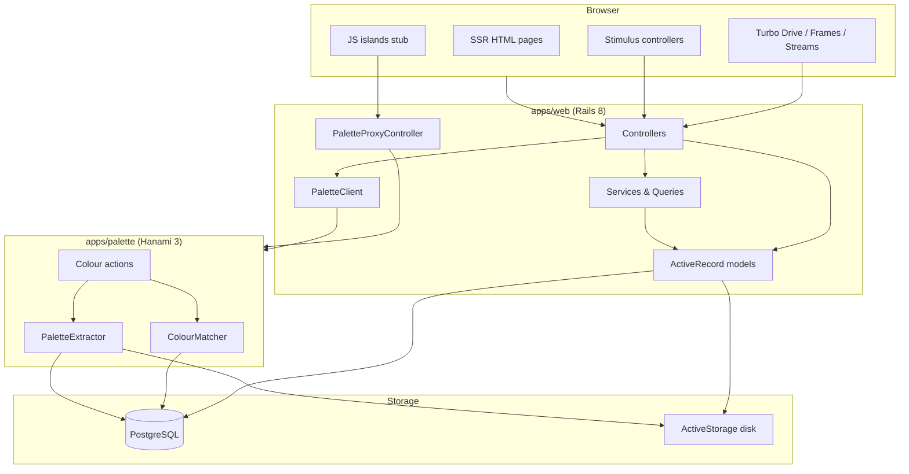
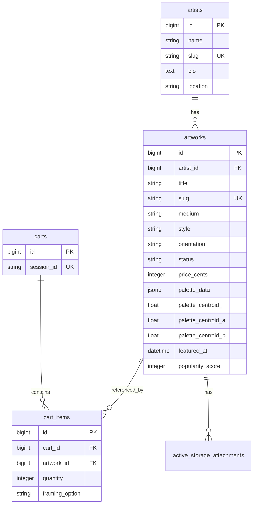

# Bluethumb Art Nano — Project Overview

A small art marketplace demo built as a Ruby monorepo. The catalogue is **100% synthetic** (procedurally generated artists, images, and palette data). Not affiliated with [Bluethumb](https://bluethumb.com.au).

This document describes the full stack: structure, architecture, frontend, backend, database, services, and operational patterns.

---

## Table of contents

1. [Monorepo structure](#monorepo-structure)
2. [Architecture](#architecture)
3. [Technology stack](#technology-stack)
4. [Request and data flows](#request-and-data-flows)
5. [Backend — Rails (`apps/web`)](#backend--rails-appsweb)
6. [Backend — Hanami (`apps/palette`)](#backend--hanami-appspalette)
7. [Database](#database)
8. [Frontend structure](#frontend-structure)
9. [Design system](#design-system)
10. [External services and configuration](#external-services-and-configuration)
11. [Testing](#testing)
12. [Development tooling](#development-tooling)
13. [Contracts and documentation](#contracts-and-documentation)
14. [Optimizations and performance notes](#optimizations-and-performance-notes)
15. [Scope boundaries and known limitations](#scope-boundaries-and-known-limitations)

---

## Monorepo structure

```
bluethumb-art-nano/
├── apps/
│   ├── web/                 # Rails 8 — marketplace UI, sessions, catalogue
│   └── palette/             # Hanami 3 — colour extraction & similarity API
├── bin/                     # Monorepo entrypoints (setup, dev, test, rails, palette)
├── docs/
│   ├── overview.md          # This file
│   └── contracts/           # OpenAPI + JSON Schema for palette API/data
├── .github/workflows/       # CI (Postgres + bin/test)
├── .cursor/rules/           # Agent/editor conventions per app area
├── Procfile.dev             # Foreman: Rails :3000 + Hanami :9292
├── .env.example             # DATABASE_URL, PALETTE_SERVICE_URL
├── README.md                # Public engineering docs
└── AGENTS.md                # Agent workflow and app boundaries
```

There is **no `packages/` directory** — the two apps integrate via HTTP and a shared PostgreSQL database, not shared Ruby/JS packages.

### App responsibilities

| App            | Port (dev) | Owns                                                                                       |
| -------------- | ---------- | ------------------------------------------------------------------------------------------ |
| `apps/web`     | 3000       | HTML, sessions, cart, checkout stub, faceted browse, Slim views, Hotwire, catalogue models |
| `apps/palette` | 9292       | Palette extraction, CIELAB similarity, colour JSON API, dry-validation contracts           |

**Rule:** Rails persists catalogue data and renders pages. Hanami owns colour math and JSON endpoints. Business logic is not duplicated across apps.

---

## Architecture

### High-level diagram



### Architectural principles

| Principle                   | Implementation                                                                                                  |
| --------------------------- | --------------------------------------------------------------------------------------------------------------- |
| **SSR-first browse**        | `/artworks` renders tiles, count, facets, sort links, and Pagy pagination in the initial HTML response          |
| **Composable facet URLs**   | Filters live in the path: `/artworks/style/abstract/price/500-1000/sort/price-asc` — URL is the source of truth |
| **Progressive enhancement** | Turbo Frames update browse results; Turbo Streams update cart count — no SPA required                           |
| **Session commerce**        | Cart and favourites live in Rails session + DB rows keyed by `session_id` — no user accounts                    |
| **Colour as a service**     | Hanami exposes JSON; Rails calls it server-side (`PaletteClient`) and proxies browser requests (`/palette/*`)   |
| **Synthetic catalogue**     | `ArtworkGenerator` + `PaletteDataBuilder` produce reproducible demo data                                        |

---

## Technology stack

| Layer                | Technology                   | Notes                                                   |
| -------------------- | ---------------------------- | ------------------------------------------------------- |
| Runtime              | Ruby 3.3.5 (`.ruby-version`) | README targets 3.4; repo pins 3.3.5                     |
| Web framework        | Rails 8.1                    | Propshaft, importmap, Slim, Tailwind v4                 |
| Services framework   | Hanami ~> 3.0                | README says Hanami 2; Gemfile uses 3.x                  |
| Database             | PostgreSQL 14+               | Shared by both apps                                     |
| Templates            | Slim                         | All HTML views                                          |
| Styles               | Tailwind CSS v4              | `tailwindcss-rails`, design tokens in `application.css` |
| Interactivity        | Hotwire (Turbo + Stimulus)   | importmap — no npm bundler                              |
| Islands              | Vue 3 islands (vendored)     | ColourPicker + RoomMatch; importmap, no bundler         |
| Search               | `pg_search`                  | Full-text on title, description, artist name            |
| Pagination           | Pagy                         | Default 24 items per page                               |
| Images               | ActiveStorage (disk)         | Artwork primary + gallery images                        |
| Validation (palette) | dry-validation               | Extract / similar / match-room contracts                |
| Colour extraction    | `ruby-vips` + VibrantPalette | Histogram quantization; procedural fallback             |
| Tests                | RSpec + Capybara             | `bin/test` runs both apps                               |

---

## Request and data flows

### Faceted browse

```
GET /artworks/style/abstract/price/500-1000
  → ArtworksController#index
  → Artworks::FacetParser.parse(["style","abstract","price","500-1000"])
  → Artworks::FacetQuery.new(facets).call
  → pagy(scope, limit: 24)
  → render index (+ turbo_frame partial if Turbo-Frame header)
```

Facet keys: `style`, `medium`, `price`, `orientation`, `colour`, `sort`, `size`, `q`.

Search can also arrive as `?q=term` on `/artworks` or as a facet segment `/artworks/q/term`.

### Artwork detail + similar by colour

```
GET /artworks/:slug
  → ArtworksController#show
  → load artwork, related (same style), cart item
  → similar_by_colour(artwork)
       if palette_centroid_l present:
         PaletteClient#similar(id) → GET http://localhost:9292/colour/similar/:id
         reorder results with in_order_of(:id, ids)
  → render show (SSR sections for related + colour-similar tiles)
```

### Cart and checkout (stub)

```
POST /cart_items          → find_or_create cart item (session cart)
DELETE /cart_items/:id    → remove line (Turbo Stream or HTML redirect)
GET /checkout             → checkout form (guarded: cart must not be empty)
POST /checkout            → store order in session[:last_order], clear cart items
GET /checkout/thank-you   → read session order (redirect if missing)
```

### Style quiz → browse

```
GET /discover?step=1..3   → multi-step form (style → budget → size optional)
PATCH /discover           → merge answers into session[:style_quiz]
                          → redirect to /artworks/style/.../price/.../size/...
```

### Palette proxy (browser → Hanami)

```
GET /palette/colour/similar/42
  → PaletteProxyController#forward
  → Net::HTTP to PALETTE_SERVICE_URL/colour/similar/42
  → pass-through status, body, content-type
```

---

## Backend — Rails (`apps/web`)

### Directory layout

```
apps/web/
├── app/
│   ├── controllers/       # HTTP layer
│   ├── models/            # ActiveRecord
│   ├── views/             # Slim templates + partials
│   ├── helpers/           # View helpers
│   ├── services/          # HTTP clients, facet parser, palette builder
│   ├── queries/           # FacetQuery (browse scope assembly)
│   ├── javascript/        # Stimulus + islands (importmap)
│   └── assets/tailwind/   # Tailwind source + design tokens
├── config/
│   ├── routes.rb
│   ├── database.yml
│   ├── importmap.rb
│   └── initializers/      # pagy, CSP (allows :9292 in dev)
├── db/
│   ├── migrate/
│   ├── schema.rb
│   └── seeds.rb
├── lib/
│   ├── artwork_generator.rb
│   ├── artwork_slug_constraint.rb
│   └── tasks/             # artworks:regenerate, palettes:extract
└── spec/                  # RSpec (request, system, model, service)
```

### Controllers

| Controller               | Routes                                               | Role                                                        |
| ------------------------ | ---------------------------------------------------- | ----------------------------------------------------------- |
| `ApplicationController`  | —                                                    | Session cart (`set_current_cart`), favourites helpers, Pagy |
| `HomeController`         | `GET /`                                              | Hero, staff picks, shop-by-style tiles                      |
| `ArtworksController`     | `GET /artworks(/*facets)`, `GET /artworks/:slug`     | Faceted browse + detail; Turbo Frame partial                |
| `ArtistsController`      | `GET /artists/:slug`                                 | Artist profile and works                                    |
| `DiscoverController`     | `GET/PATCH/POST /discover`                           | 3-step style quiz                                           |
| `CartsController`        | `GET /cart`                                          | Cart page                                                   |
| `CartItemsController`    | `POST/PATCH/DELETE /cart_items`                      | Add/update/remove; Turbo Streams                            |
| `CheckoutsController`    | `GET/POST /checkout`, `GET /checkout/thank-you`      | Checkout stub                                               |
| `FavouritesController`   | `POST /favourites`, `DELETE /favourites/:artwork_id` | Session favourites                                          |
| `LoginsController`       | `GET /login`                                         | Placeholder sign-in page                                    |
| `PaletteProxyController` | `ALL /palette/*path`                                 | Reverse proxy to Hanami                                     |

No domain background jobs are implemented — `ApplicationJob` is a stub.

### Models

| Model      | Table        | Key behaviour                                                                                 |
| ---------- | ------------ | --------------------------------------------------------------------------------------------- |
| `Artist`   | `artists`    | `has_many :artworks`; slug generated on create                                                |
| `Artwork`  | `artworks`   | Catalogue entity; `pg_search`, ActiveStorage, facet scopes, palette fields, framing constants |
| `Cart`     | `carts`      | Session-bound via `session_id`; computes subtotal, framing total, total                       |
| `CartItem` | `cart_items` | One row per artwork per cart; optional `framing_option` (+$250)                               |

**Artwork constants:** `MEDIUMS`, `STYLES`, `ORIENTATIONS`, `HUE_FAMILIES`, `FRAMING_OPTIONS`, `FRAMING_PRICE_CENTS` (25_000 = $250).

**Artwork#to_param** returns `slug` so path helpers generate SEO-friendly URLs.

### Services

| Service                 | Path                                    | Purpose                                                               |
| ----------------------- | --------------------------------------- | --------------------------------------------------------------------- |
| `Artworks::FacetParser` | `app/services/artworks/facet_parser.rb` | Parse composable URL segments into a facet hash; validate keys/values |
| `Artworks::FacetQuery`  | `app/queries/artworks/facet_query.rb`   | Apply facets, full-text search, sort scopes to an `Artwork` relation  |
| `PaletteClient`         | `app/services/palette_client.rb`        | HTTP client: `health`, `extract`, `similar`                           |
| `PaletteDataBuilder`    | `app/services/palette_data_builder.rb`  | Procedural CIELAB centroid + `hue_family` for seed data               |

### Lib tasks and generators

| File                             | Purpose                                                    |
| -------------------------------- | ---------------------------------------------------------- |
| `lib/artwork_generator.rb`       | Procedural artists/artworks/images (ChunkyPNG)             |
| `lib/artwork_slug_constraint.rb` | Route constraint: reject facet keys as artwork slugs       |
| `lib/tasks/artworks.rake`        | `artworks:regenerate ARTWORK_COUNT=N`                      |
| `lib/tasks/palettes.rake`        | `palettes:extract` — batch call to Hanami extract endpoint |

### Routes summary

```ruby
root                    → home#index
discover                → discover#show / #update
login                   → logins#show
cart                    → carts#show
checkout                → checkouts#show / #create
checkout/thank-you      → checkouts#thank_you
artworks/:slug          → artworks#show    # ArtworkSlugConstraint
artworks(/*facets)      → artworks#index
artists/:slug           → artists#show
cart_items              → create, update, destroy
favourites              → create
favourites/:artwork_id  → destroy
/palette/*path          → palette_proxy#forward
up                      → rails health check
```

### Session state

| Session key                       | Written by                               | Read by                          |
| --------------------------------- | ---------------------------------------- | -------------------------------- |
| `session[:cart_session_id]`       | `ApplicationController#set_current_cart` | All pages (header cart count)    |
| `session[:favourite_artwork_ids]` | `FavouritesController`                   | Artwork detail Save/Saved toggle |
| `session[:style_quiz]`            | `DiscoverController#update`              | Quiz steps (Back link preserves) |
| `session[:last_order]`            | `CheckoutsController#create`             | Thank-you page                   |

---

## Backend — Hanami (`apps/palette`)

### Directory layout

```
apps/palette/
├── app/actions/
│   ├── health/show.rb
│   └── colour/
│       ├── extract.rb
│       ├── similar.rb
│       └── match_room.rb
├── lib/
│   ├── colour_matcher.rb      # ΔE76 distance ranking
│   ├── palette_extractor.rb   # VibrantPalette → CIELAB → hue_family
│   └── vibrant_palette.rb     # libvips histogram quantization
├── slices/colour/contracts/   # dry-validation (extract, similar, match_room)
├── config/
│   ├── app.rb                 # JSON body parser middleware
│   ├── routes.rb
│   └── puma.rb
└── spec/                      # Request + lib specs
```

### API endpoints

| Method | Path                          | Action                                                          | Status       |
| ------ | ----------------------------- | --------------------------------------------------------------- | ------------ |
| `GET`  | `/health`                     | Health check                                                    | Implemented  |
| `POST` | `/colour/extract`             | Extract palette from ActiveStorage image; persist to `artworks` | Implemented  |
| `GET`  | `/colour/similar/:artwork_id` | Rank neighbours by CIELAB ΔE76                                  | Implemented  |
| `POST` | `/colour/match-room`          | Room photo → artwork ranking                                    | Implemented  |

Hanami reads/writes the shared `artworks` table via raw `PG` connections (not ActiveRecord). It reads ActiveStorage blob paths from `apps/web/storage` (configurable via `ACTIVE_STORAGE_ROOT`).

### Colour pipeline

```
Image (ActiveStorage or room upload)
  → VibrantPalette (libvips hist_find_ndim) or procedural fallback
  → PaletteExtractor
       population-weighted CIELAB centroid
       HSV hue_family (neutral when low saturation/value)
  → persist palette_data jsonb + palette_centroid_l/a/b (extract)
     or rank available artworks by ΔE76 (match-room / similar)

Similarity / match-room query
  → ColourMatcher
       load available artworks with centroids
       compute ΔE76 distance to source
       return sorted list (in-memory for demo scale)
```

---

## Database

**Engine:** PostgreSQL  
**Schema file:** `apps/web/db/schema.rb` (version `2026_08_29_000001`)  
**Views:** none  
**Extensions:** `plpgsql`

### Entity relationship



### Tables

#### `artists`

| Column            | Type        | Notes                   |
| ----------------- | ----------- | ----------------------- |
| `name`, `slug`    | string      | slug unique             |
| `bio`, `location` | text/string | optional profile fields |
| timestamps        | datetime    |                         |

#### `artworks`

| Column                              | Type         | Notes                               |
| ----------------------------------- | ------------ | ----------------------------------- |
| `artist_id`                         | FK           | indexed                             |
| `title`, `slug`                     | string       | slug unique                         |
| `description`                       | text         | searchable via pg_search            |
| `width_cm`, `height_cm`, `depth_cm` | integer      | dimensions                          |
| `weight_kg`                         | decimal(6,2) | shipping estimate stub              |
| `medium`, `style`, `orientation`    | string       | facet dimensions                    |
| `price_cents`                       | integer      | AUD cents                           |
| `status`                            | string       | `available` or `sold`               |
| `generation_seed`                   | jsonb        | procedural image params             |
| `palette_data`                      | jsonb        | swatches, hue_family, centroid      |
| `palette_centroid_l/a/b`            | float        | denormalized for similarity queries |
| `palette_extracted_at`              | datetime     | last extraction time                |
| `featured_at`                       | datetime     | staff picks                         |
| `popularity_score`                  | integer      | sort facet                          |

#### `carts` / `cart_items`

- One cart per browser session (`session_id` unique).
- One cart item per artwork per cart (unique composite index).
- `framing_option`: `natural`, `black`, or `white` (+$250 per unit).

#### Active Storage (Rails standard)

| Table                            | Purpose                                                   |
| -------------------------------- | --------------------------------------------------------- |
| `active_storage_blobs`           | File metadata (`key` unique)                              |
| `active_storage_attachments`     | Polymorphic link to `Artwork` (`image`, `gallery_images`) |
| `active_storage_variant_records` | Variant digests for image processing                      |

### Indexes and query patterns

| Index                                        | Columns                                                   | Purpose                 |
| -------------------------------------------- | --------------------------------------------------------- | ----------------------- |
| `index_artworks_on_slug`                     | `slug` UNIQUE                                             | Detail page lookup      |
| `index_artworks_facets_available`            | `style, medium, price_cents` WHERE `status = 'available'` | Faceted browse          |
| `index_artworks_on_status_and_price_cents`   | `status, price_cents`                                     | Price filtering/sorting |
| `index_artworks_on_featured_at`              | `featured_at` WHERE NOT NULL                              | Staff picks             |
| `index_artworks_on_popularity_score`         | `popularity_score`                                        | Popular sort            |
| `index_cart_items_on_cart_id_and_artwork_id` | composite UNIQUE                                          | One line per artwork    |

### Migrations (chronological)

1. `20250828000001_create_artists.rb`
2. `20250828000002_create_artworks.rb` — core catalogue + palette columns + facet index
3. `20250828000003_create_carts.rb`
4. `20250828000004_create_cart_items.rb`
5. `20260828143929_create_active_storage_tables.active_storage.rb`
6. `20260829000001_phase2_marketplace_fields.rb` — `featured_at`, `popularity_score`, `framing_option`

---

## Frontend structure

### Rendering model

All primary pages are **server-rendered Slim templates**. JavaScript enhances navigation and cart updates; the browse page works without JS.

### Page map

| Page           | Template                        | Key partials / behaviour                                |
| -------------- | ------------------------------- | ------------------------------------------------------- |
| Home           | `home/index.html.slim`          | Staff picks grid, style tiles, quiz CTA                 |
| Browse         | `artworks/index.html.slim`      | Sidebar facets, chips, Turbo Frame results              |
| Artwork detail | `artworks/show.html.slim`       | Gallery, framing, favourites, related + colour sections |
| Artist         | `artists/show.html.slim`        | Profile + available works                               |
| Style quiz     | `discover/show.html.slim`       | 3-step radio form                                       |
| Cart           | `carts/show.html.slim`          | Line items, framing surcharge, summary                  |
| Checkout       | `checkouts/show.html.slim`      | Address form stub                                       |
| Thank you      | `checkouts/thank_you.html.slim` | Order summary from session                              |
| Login          | `logins/show.html.slim`         | Placeholder copy                                        |

### Shared partials (`app/views/shared/`)

| Partial                   | Used for                                    |
| ------------------------- | ------------------------------------------- |
| `_artwork_tile.html.slim` | Reusable artwork card (image, title, price) |
| `_page_header.html.slim`  | Consistent page titles                      |
| `_flash.html.slim`        | Notice/alert messages                       |
| `_footer.html.slim`       | Site footer                                 |
| `_trust_badges.html.slim` | Delivery/guarantee badges on PDP/checkout   |
| `_cart_count.html.slim`   | Header cart badge (Turbo Frame target)      |

### Browse components (`app/views/artworks/`)

| Partial                    | Role                                                               |
| -------------------------- | ------------------------------------------------------------------ |
| `_sidebar.html.slim`       | Facet navigation (style, medium, price, size, orientation, colour) |
| `_facet_chips.html.slim`   | Active filter chips with remove links                              |
| `_results_frame.html.slim` | Turbo Frame `artworks_results` — tile grid + Pagy                  |
| `_tile.html.slim`          | Single tile wrapper (delegates to shared tile)                     |

### Hotwire integration

| Mechanism                          | Where                          | Effect                                       |
| ---------------------------------- | ------------------------------ | -------------------------------------------- |
| **Turbo Drive**                    | Default                        | Fast full-page navigation                    |
| **Turbo Frame** `artworks_results` | Browse sidebar/sort links      | Replace result grid without full reload      |
| **Turbo Frame** `cart_count`       | Layout header                  | Cart badge updates                           |
| **Turbo Stream**                   | `cart_items/create`, `destroy` | Stream update to `#cart_count` on add/remove |

### Stimulus controllers (`app/javascript/controllers/`)

| Controller | File                    | Behaviour                                     |
| ---------- | ----------------------- | --------------------------------------------- |
| `gallery`  | `gallery_controller.js` | Swap main image when thumbnail clicked on PDP |
| `flash`    | `flash_controller.js`   | Auto-dismiss flash messages after 5 seconds   |
| `hello`    | `hello_controller.js`   | Rails scaffold stub (unused)                  |

### JS islands (`app/javascript/islands/`)

Vendored **Vue 3** islands mounted on `[data-island-component]` placeholders with props in `data-island-props`:

| Island         | Mount                                | Role                                      |
| -------------- | ------------------------------------ | ----------------------------------------- |
| `ColourPicker` | Artwork detail when swatches exist   | Pick a swatch → colour-matches JSON       |
| `RoomMatch`    | `/match-room`                        | Upload room photo → ranked artworks JSON  |

Import map (`config/importmap.rb`) pins Turbo, Stimulus, Vue, and islands — **no npm `package.json` or bundler**.

### Layout (`layouts/application.html.slim`)

- Sticky header with logo, nav links, search form, cart Turbo Frame
- Skip link, flash partial, main yield, footer
- Search form: `GET /artworks?q=…` (hidden on small screens via Tailwind `hidden sm:block`)

---

## Design system

**Source:** `apps/web/app/assets/tailwind/application.css`  
**Built output:** `apps/web/app/assets/builds/tailwind.css`

### Design tokens (`@theme`)

| Token                  | Value               | Usage                    |
| ---------------------- | ------------------- | ------------------------ |
| `--color-accent`       | `#c45c26`           | Links, focus rings       |
| `--color-accent-hover` | `#a34a1e`           | Hover states             |
| `--color-accent-light` | `#fdf4ef`           | Light accent backgrounds |
| `--shadow-card`        | subtle stone shadow | Cards                    |
| `--shadow-card-hover`  | elevated shadow     | Hover lift on tiles      |

### Component classes (`@layer components`)

| Class                                                      | Purpose                                  |
| ---------------------------------------------------------- | ---------------------------------------- |
| `.card` / `.card-hover`                                    | White rounded containers with hover lift |
| `.btn-primary` / `.btn-secondary`                          | Primary (stone-900) and outline buttons  |
| `.input-field`                                             | Form inputs with accent focus ring       |
| `.chip` / `.chip-removable`                                | Facet chips                              |
| `.facet-pill` / `.facet-pill-active`                       | Sidebar facet links                      |
| `.sort-pill` / `.sort-pill-active` / `.sort-pill-inactive` | Sort controls                            |
| `.meta-text`                                               | Secondary descriptive text (stone-500)   |
| `.skip-link`                                               | Accessibility skip navigation            |

### Browse layout

Results use **CSS multi-column masonry** (`columns-2 md:columns-3 lg:columns-4`) in `_results_frame.html.slim` for a gallery-style grid without JS.

---

## External services and configuration

### Environment variables (`.env`)

| Variable              | Default                                                    | Purpose                                       |
| --------------------- | ---------------------------------------------------------- | --------------------------------------------- |
| `DATABASE_URL`        | `postgres://localhost:5432/bluethumb_art_nano_development` | PostgreSQL connection (Rails + Hanami)        |
| `PALETTE_SERVICE_URL` | `http://localhost:9292`                                    | Hanami base URL for `PaletteClient` and proxy |
| `ACTIVE_STORAGE_ROOT` | `apps/web/storage` (palette extract)                       | Where Hanami reads blob files                 |

`bin/test` rewrites `DATABASE_URL` to use `bluethumb_art_nano_test` and aborts if pointed at development.

### Services matrix

| Service              | Used | Notes                                                             |
| -------------------- | ---- | ----------------------------------------------------------------- |
| PostgreSQL           | Yes  | Single shared database                                            |
| ActiveStorage (disk) | Yes  | Dev: `storage/`; test: `tmp/storage`                              |
| Hanami palette API   | Yes  | Required for extract/similar; graceful degradation on PDP if down |
| Redis                | No   | Commented out in Gemfile                                          |
| S3/GCS               | No   | Commented in `storage.yml`                                        |
| Payment gateway      | No   | Checkout is a session stub                                        |
| OAuth / accounts     | No   | Login page is placeholder                                         |

### Content Security Policy

Development CSP allows connections to `localhost:9292` so the palette proxy and islands can reach Hanami.

---

## Testing

**Canonical command:** `bin/test` — prepares test DB, runs RSpec in both apps.

**Current suite:** 68 examples (61 web + 7 palette), 0 failures.

### Web specs (`apps/web/spec/`)

| Type                               | Coverage                                                                                                           |
| ---------------------------------- | ------------------------------------------------------------------------------------------------------------------ |
| **Request**                        | Browse facets, search, show, artists, home, discover, cart, cart items, checkout, favourites, login, palette proxy |
| **System (Capybara `:rack_test`)** | Marketplace journey, discovery quiz, search, favourites, cart remove, framing, sold artwork                        |
| **Model**                          | `Artwork` validations/scopes                                                                                       |
| **Service**                        | `FacetParser`, `PaletteClient`                                                                                     |

Support files: `palette_webmock.rb`, `capybara.rb`, `factory_bot.rb`.

### Palette specs (`apps/palette/spec/`)

| Type        | Coverage                                  |
| ----------- | ----------------------------------------- |
| **Request** | Health, colour extract/similar/match-room |
| **Lib**     | `ColourMatcher` distance logic            |

### CI

`.github/workflows/test.yml` — Postgres 16 service container, runs `bin/test` on push/PR to `main`.

---

## Development tooling

| Script        | Purpose                                                |
| ------------- | ------------------------------------------------------ |
| `bin/setup`   | Bundle both apps, copy `.env`, `db:prepare`, `db:seed` |
| `bin/dev`     | Foreman: Rails :3000 + Hanami :9292 + Tailwind build   |
| `bin/test`    | Full RSpec suite with test DB guard                    |
| `bin/rails`   | Delegates to `apps/web`                                |
| `bin/palette` | Delegates to Hanami CLI in `apps/palette`              |

### Seed and regeneration

```bash
bin/rails db:seed                              # default ~200 artworks
bin/rails artworks:regenerate ARTWORK_COUNT=200
bin/rails palettes:extract                     # batch palette extraction via Hanami
```

### Docker

- `apps/web/Dockerfile` — production Rails image (Ruby 3.3.5, libvips, jemalloc)
- No root `docker-compose`; local dev expects Postgres running separately (e.g. Docker container on `:5434`)

---

## Contracts and documentation

| Document                   | Path                                      | Purpose                                                                   |
| -------------------------- | ----------------------------------------- | ------------------------------------------------------------------------- |
| Palette API (OpenAPI 3.1)  | `docs/contracts/palette_api.openapi.yaml` | `/health`, `/colour/extract`, `/colour/similar/:id`, `/colour/match-room` |
| Palette data (JSON Schema) | `docs/contracts/palette_data.schema.json` | Target shape for `artworks.palette_data`                                  |
| Agent boundaries           | `AGENTS.md`                               | What each app owns; non-negotiables                                       |
| Feature audit              | `tmp/FEATURE_AUDIT.md`                    | Coverage matrix and bug fixes (internal)                                  |

**Contract note:** Runtime `palette_data` from seeds/extractor is simpler than the full JSON Schema (may omit `version`, `image_hash`, role-based swatches). Hanami reads denormalized centroid columns for similarity, not the full schema shape.

---

## Optimizations and performance notes

### Implemented

| Area           | Technique                                    | Location                               |
| -------------- | -------------------------------------------- | -------------------------------------- |
| Facet browse   | Partial index on available artworks          | `index_artworks_facets_available`      |
| Staff picks    | Partial index on `featured_at`               | schema                                 |
| Similarity     | Denormalized `palette_centroid_*` columns    | avoids JSON parsing in queries         |
| Detail/browse  | `includes(:artist, image_attachment: :blob)` | controllers                            |
| Colour ranking | `in_order_of(:id, ids)`                      | preserves Hanami distance order on PDP |
| Pagination     | Pagy, limit 24                               | `config/initializers/pagy.rb`          |
| Search         | `pg_search` with prefix matching             | title, description, artist name        |
| Boot           | Bootsnap                                     | Gemfile                                |
| Assets         | Propshaft (no Sprockets)                     | Rails 8 default                        |
| Production     | Fragment caching enabled                     | `config/environments/production.rb`    |

### Not implemented (by design for demo scale)

| Area                | Current behaviour                           | Scale note                                                    |
| ------------------- | ------------------------------------------- | ------------------------------------------------------------- |
| Background jobs     | Palette extraction is synchronous rake task | Would need job queue for large catalogues                     |
| Redis/cache         | Not configured                              | Session in cookie store                                       |
| Colour similarity   | In-memory ΔE76 over all available rows      | Fine for ~200 artworks; needs pgvector/spatial index at scale |
| CDN / cloud storage | Disk ActiveStorage only                     | Production Dockerfile supports Kamal deploy                   |

---

## Scope boundaries and known limitations

### In scope (implemented)

- SSR marketplace browse, detail, cart, checkout stub
- Session favourites and framing selector
- Style quiz → facet URL
- Palette extraction and CIELAB similar artworks
- Match my room (upload → palette → ranked catalogue)
- Full-text search

### Explicitly out of scope

- Real payments (Stripe, etc.)
- User accounts / OAuth
- Messaging between buyer and artist
- Elasticsearch
- Real Bluethumb data or images

### Known gaps

| Item                      | Status                                                |
| ------------------------- | ----------------------------------------------------- |
| `PATCH cart_items#update` | Route exists; cart page has no framing update UI      |
| README stack versions     | May differ from pinned Gemfile (Ruby 3.3.5, Hanami 3) |

### Colour notes

- Hue families use HSV buckets with a saturation/value gate for neutrals — not CIELAB hue angles.
- `VibrantPalette` is a local libvips-backed stand-in for Bluethumb's unpublished `vibrant_palette` gem (histogram quantization → population-weighted swatches).
- Centroid ranking answers "overall cast", not "contains this exact colour".

---

## Quick reference — key file paths

```
apps/web/config/routes.rb
apps/web/db/schema.rb
apps/web/app/controllers/
apps/web/app/models/
apps/web/app/services/artworks/facet_parser.rb
apps/web/app/queries/artworks/facet_query.rb
apps/web/app/views/
apps/web/app/javascript/
apps/web/lib/artwork_generator.rb
apps/palette/config/routes.rb
apps/palette/app/actions/colour/
apps/palette/lib/colour_matcher.rb
docs/contracts/
bin/test
Procfile.dev
```

For day-to-day commands and demo paths, see [README.md](../README.md). For agent workflow rules, see [AGENTS.md](../AGENTS.md).
